# Certus Diagnostics - Sequence Diagrams

This document contains sequence diagrams for the major workflows in the Certus Diagnostics system.

---

## 1. Patient Google OAuth Sign-In Flow

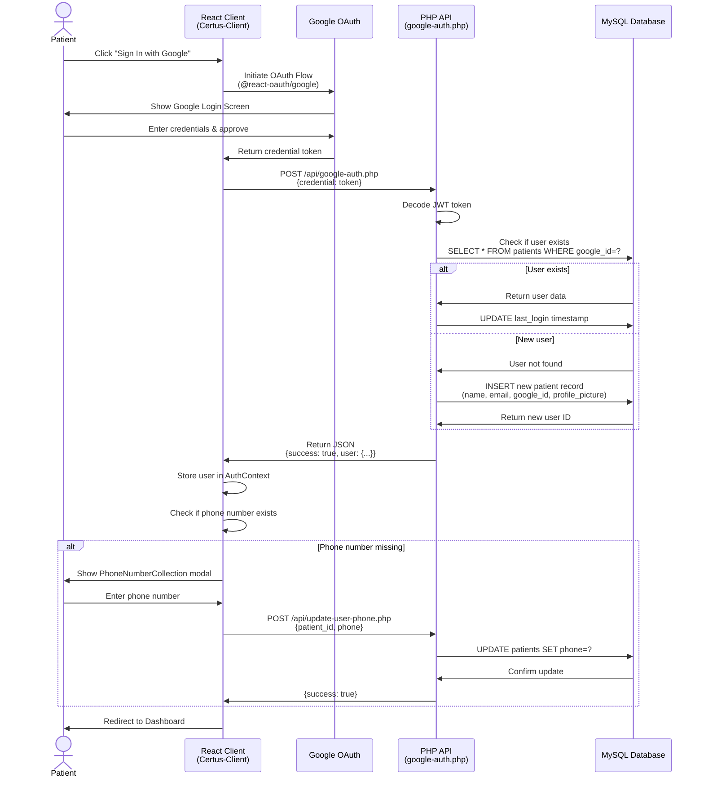

---

## 2. Admin Google OAuth Sign-In Flow

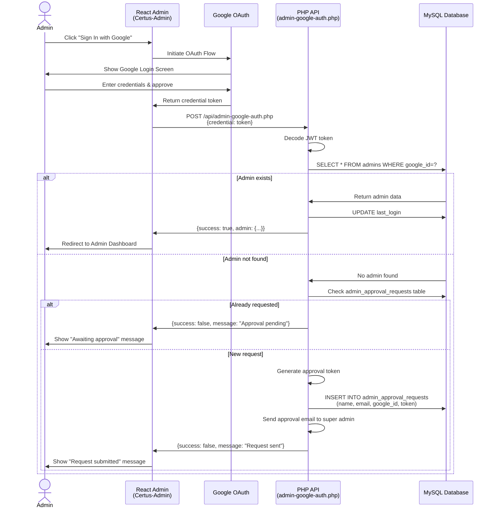

---

## 3. Patient Report Viewing Flow

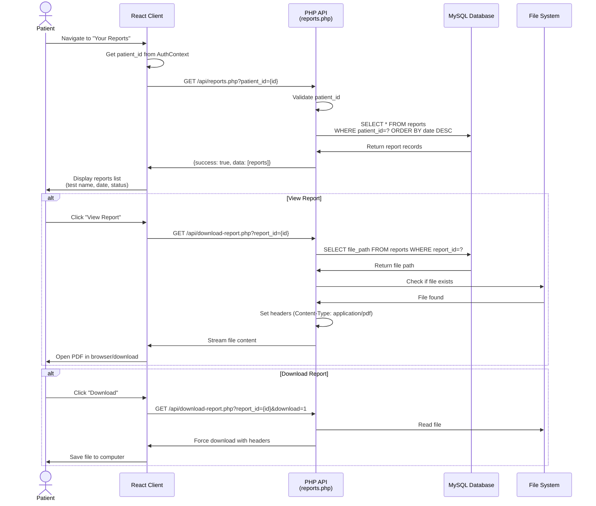

---

## 4. Admin - Upload Report for Patient

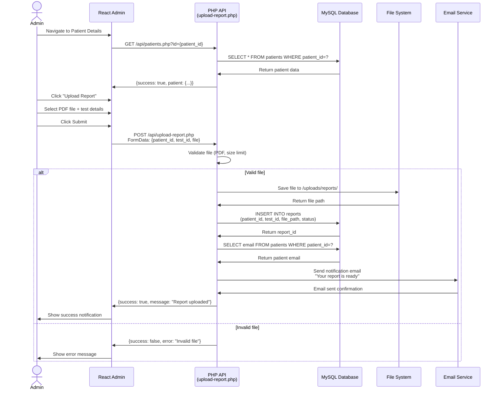

---

## 5. Patient - Book a Test/Package

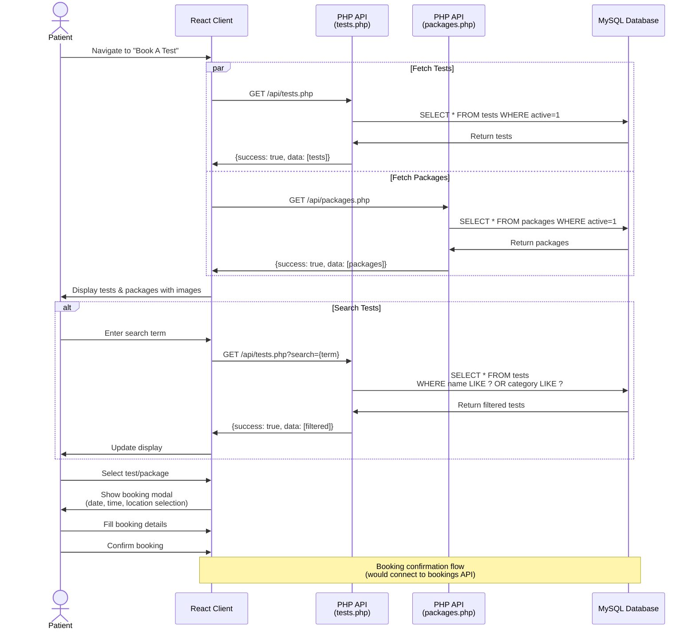

---

## 6. Admin - Manage Patients

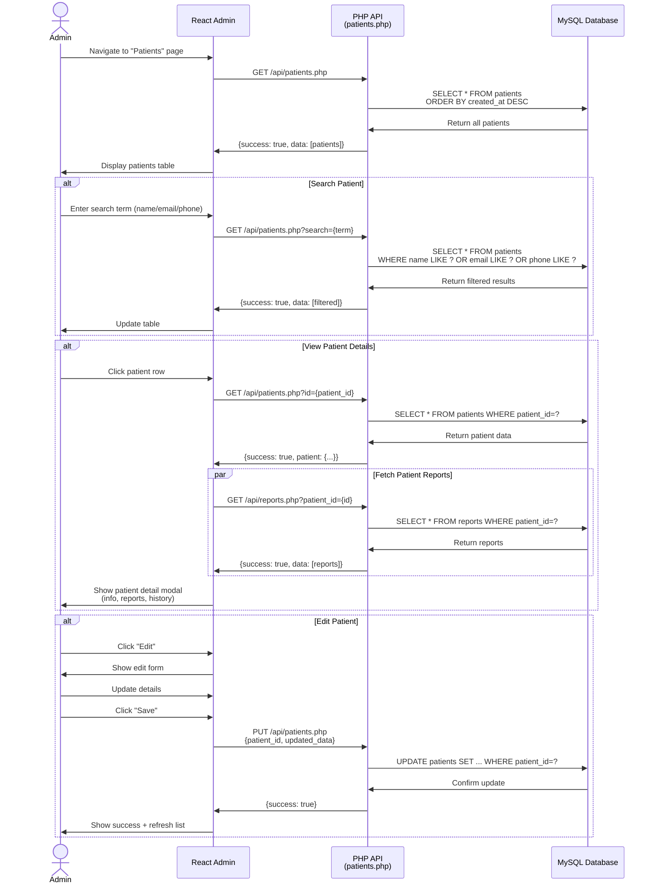

---

## 7. Google Reviews Fetch Flow

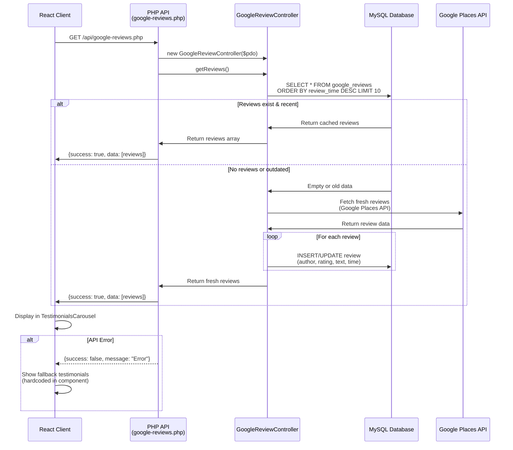

---

## 8. Admin Dashboard Analytics Flow

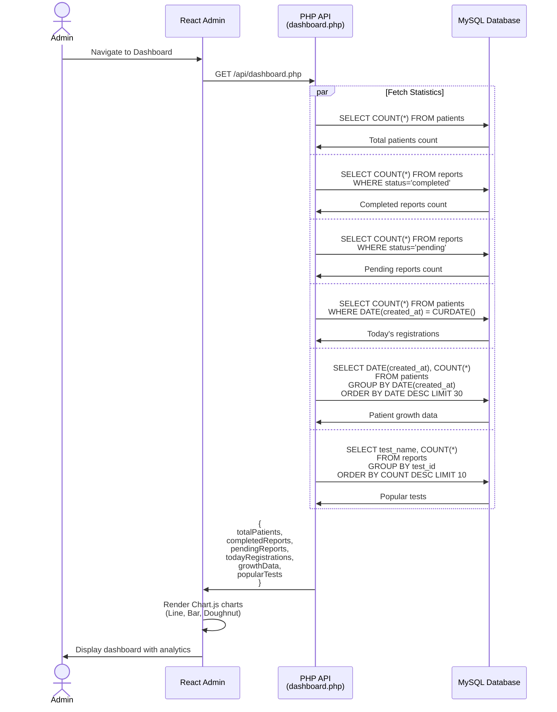

---

## 9. Test/Package Management (Admin)

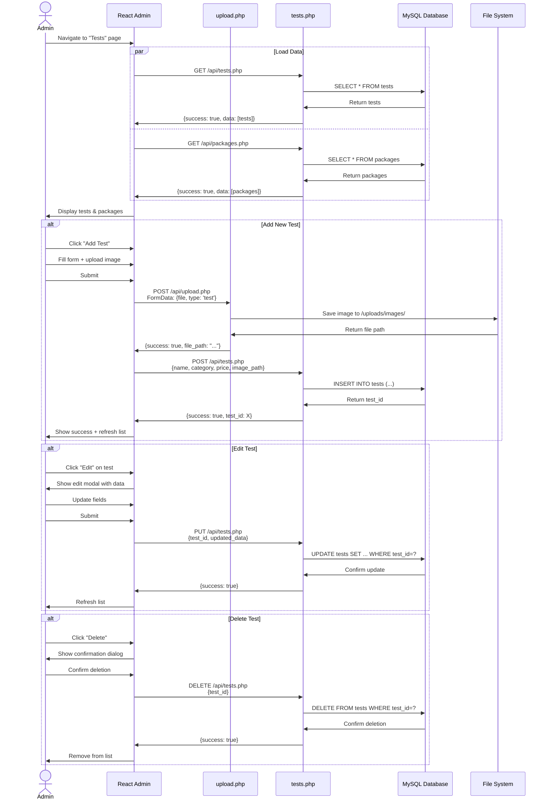

---

## 10. Error Handling & CORS Flow

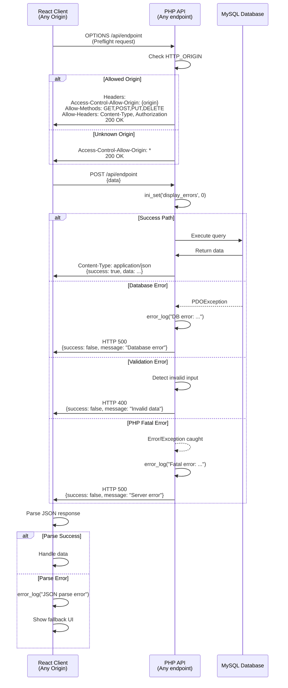

---

## System Architecture Overview

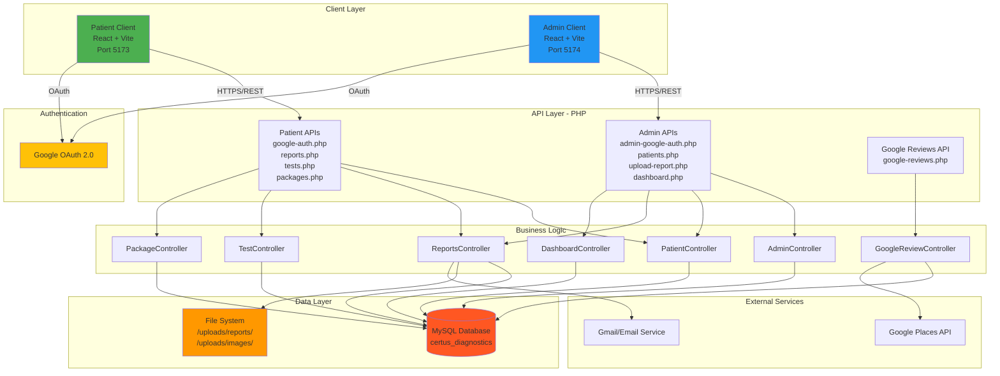

---

## Technology Stack Summary

| Layer | Technology | Purpose |
|-------|-----------|---------|
| **Frontend - Patient** | React 19, Vite, Tailwind CSS | Patient-facing web app |
| **Frontend - Admin** | React 19, Vite, Chart.js | Admin dashboard |
| **Authentication** | Google OAuth 2.0 (@react-oauth/google) | Secure user authentication |
| **Backend** | PHP 7.4+, Apache | RESTful API server |
| **Database** | MySQL 5.7+ | Data persistence |
| **ORM** | PDO (PHP Data Objects) | Database abstraction |
| **File Storage** | Local File System | Report & image storage |
| **External APIs** | Google Places API | Reviews integration |
| **Email** | PHPMailer / Gmail API | Notification service |
| **Deployment** | Hostinger, SSL/HTTPS | Production hosting |

---

## Key Data Flows

1. **Authentication Flow**: Client → Google OAuth → API → Database → Client
2. **Report Upload**: Admin → API → File System → Database → Email Service → Patient
3. **Report Download**: Patient → API → Database → File System → Patient
4. **Patient Management**: Admin → API → Database → Admin
5. **Test Booking**: Patient → API → Database → Confirmation
6. **Analytics**: Admin → API → Database (Aggregations) → Admin
7. **Reviews**: Client → API → Cache Check → Google API → Database → Client

---

## Error Handling Strategy

- **Frontend**: Try-catch with user-friendly messages + fallback UI
- **Backend**: Exception/Error catching → JSON error responses → Error logging
- **Database**: PDO exception handling → Rollback on failure
- **CORS**: Whitelist origins → Fallback to wildcard
- **File Operations**: Validation → Size/type checks → Secure storage
- **Authentication**: Token validation → Session management → Auto-refresh

---

*Generated: November 12, 2025*
*Project: Certus Diagnostics Management System*
